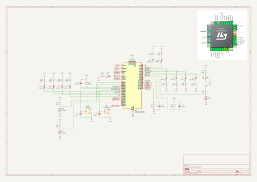

# SimpleBCM

This is the final project of my Digital Systems Lab 2 course. The goal is to recreate horn, fuel and flasher modules of a car's Body Control Module (BCM) board.
There is also diagnostics (via UART) and some protection like battery voltage monitoring to turn off the outputs if necessary to avoid damage. Also a simple preemptive task scheduler is employed to make things easier.

Every thing is done on a breadboard using [my custom STM32F072C8T6 development board](https://github.com/HayataSama/stm32f072-breakout-board).

## Schematic

